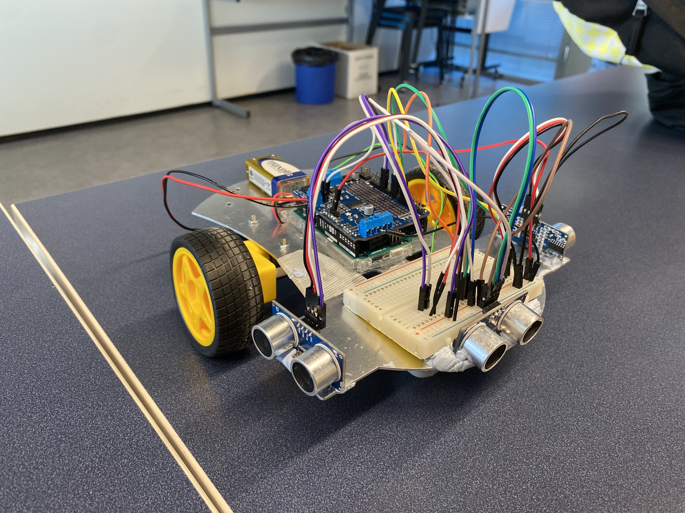

# Maze-Solving Robot Project

The coursework on a robotics course at the School of Computing (UEF). My friends and I built and programmed a maze-solving robot. 

## 📖 Introduction
Our goal was to build a maze-solving robot using the left-hand wall-following algorithm. The robot makes left turns whenever possible, moves straight if the left path is blocked, and turns right or performs a 180-degree turn when necessary. By repeating this logic, the robot successfully navigates out of the maze.

You can watch a demo video of the robot here: [Demo video on YouTube](https://youtu.be/TwOko4wgAwU)

## ⚙️ Technical Implementation
### Components Used
- Arduino Uno microcontroller
- 3 ultrasonic sensors
- 2 DC motors with wheels
- Breadboard
- Adafruit Motor Shield
- 9V power supply
- GY-91 gyroscope sensor (partially used)
- Various wires and connectors

### Key Features
- Wall-following algorithm
- PID control for improved accuracy
- Modular design with reusable components

## 🛠️ Build Process
- **Hardware Assembly**: Assembled components, tested sensor values, and constructed the robot base.
- **Programming**: Developed code using Arduino IDE in C++. Implemented and fine-tuned a left-hand wall-following algorithm.

## 🎯 Outcome
- The robot successfully navigated the maze under optimized conditions.
- Limitations included sensitivity to power source changes and occasional sensor inaccuracies.

## 📂 Repository Structure
- `Code/`: Arduino code files.

## 💡 Lessons Learned
- Hands-on experience with Arduino and robotics.
- Importance of precise hardware connections and robust coding practices.
- Insights into PID control and sensor-based navigation.

## 🛠️ Authors
- **Veikka Kukko**: Programming, assembly, testing.
- **Piia Vilén**: Design, assembly, debugging.
- **Oliver Lehto**: Conceptualization, hardware integration, documentation.
